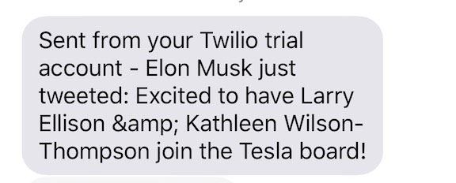

# Tesla Alert 🚨
Python script that sends the user an SMS when Elon Musk mentions 'Tesla' in a tweet.

## Installation

### Running on your local machine
  * Make sure you have Python 3 installed, if not follow instructions on this [link](https://realpython.com/installing-python/). Install the dependencies contained in the requirements.txt using `pip3 install`.
  * Create a Twitter app on https://dev.twitter.com and get the following: consumer key, consumer secret, access token key, and access token secret.
  * Create a Twilio account on https://www.twilio.com and get your account SID and auth token.
  * Edit 'main.py' variables values with your info and run 'python main.py'

### Deploying to Heroku
  * Create a heroku account and install the heroku CLI. Follow this tutorial [(link)](https://devcenter.heroku.com/articles/getting-started-with-python).
  * Clone this repo and run `heroku create`

## Demo

